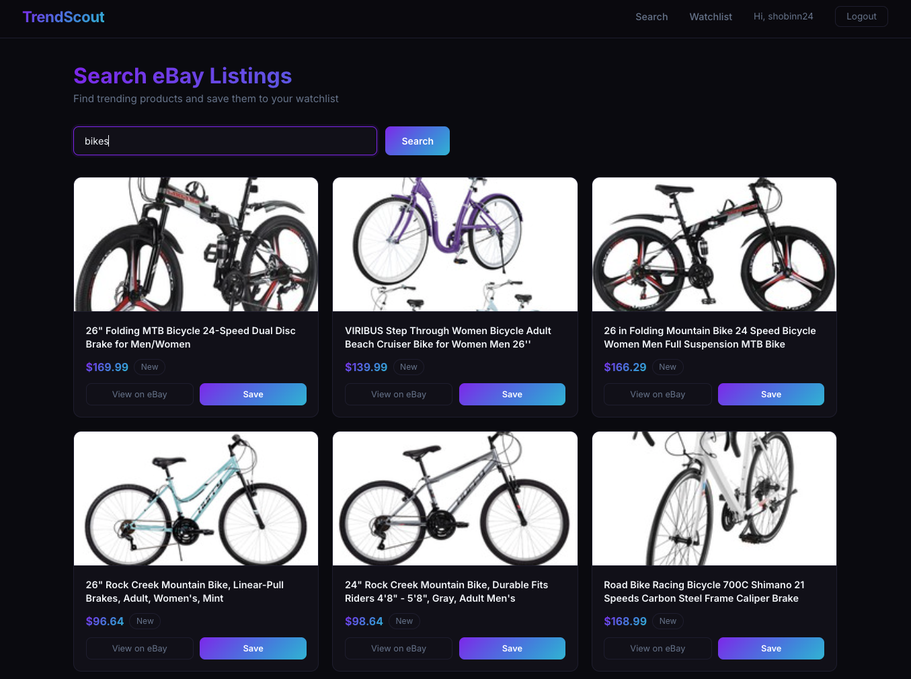

# TrendScout 🔍

A full-stack eBay market research dashboard that lets sellers search live listings, analyze watch counts and pricing, and save products to a personal watchlist.



## Live Demo

🌐 [trendscout-frontend.vercel.app](https://trendscout-frontend.vercel.app)

## Features

- **User Authentication** — Secure signup and login with JWT tokens
- **eBay Product Search** — Search any product and see live listings with prices, watch counts, and condition
- **Personal Watchlist** — Save products to your account for research tracking
- **Notes** — Add and edit research notes on saved products
- **Pagination** — Watchlist supports paginated results
- **Ownership Enforcement** — Users can only access and modify their own data

## Tech Stack

**Frontend**
- React 18
- React Router v6
- Context API for auth state
- Deployed on Vercel

**Backend**
- Python / Flask
- Flask-JWT-Extended (token-based auth)
- Flask-SQLAlchemy + Flask-Migrate
- Flask-Bcrypt (password hashing)
- Flask-CORS
- Deployed on Railway

**Database**
- PostgreSQL (production)
- SQLite (development)

**External API**
- eBay Browse API (OAuth 2.0 client credentials)

## Data Model

**User**
- id, username, email, password_hash, created_at

**SavedProduct** (belongs to User)
- id, user_id, ebay_item_id, title, price, watch_count, image_url, notes, created_at

## API Endpoints

| Method | Endpoint | Description | Auth Required |
|--------|----------|-------------|---------------|
| POST | /api/auth/signup | Create new account | No |
| POST | /api/auth/login | Login and get token | No |
| GET | /api/auth/me | Get current user | Yes |
| GET | /api/search?q={query} | Search eBay listings | Yes |
| GET | /api/watchlist | Get user's watchlist | Yes |
| POST | /api/watchlist | Save product to watchlist | Yes |
| PATCH | /api/watchlist/:id | Update product notes | Yes |
| DELETE | /api/watchlist/:id | Remove from watchlist | Yes |

## Setup & Installation

### Prerequisites
- Python 3.10+
- Node.js 18+
- eBay Developer account (free at developer.ebay.com)

### Backend Setup

```bash
cd backend
pip install -r requirements.txt
```

Create a `.env` file in the backend folder:
```
EBAY_CLIENT_ID=your_ebay_client_id
EBAY_CLIENT_SECRET=your_ebay_client_secret
JWT_SECRET_KEY=your_secret_key
DATABASE_URL=sqlite:///trendscout.db
```

Run migrations and start the server:
```bash
flask db upgrade
python app.py
```

Backend runs on `http://localhost:5555`

### Frontend Setup

```bash
cd frontend
npm install
npm start
```

Frontend runs on `http://localhost:3000`

## Core Functionality

1. **Sign up or log in** to get a JWT token stored in localStorage
2. **Search** for any product — results are fetched live from eBay's Browse API
3. **Save** interesting products to your personal watchlist with one click
4. **Add notes** to saved products to track sourcing ideas or pricing observations
5. **Remove** products from your watchlist when done researching

## Git History

Development followed an incremental commit strategy:
- Backend foundation (models, auth, CRUD)
- eBay API integration
- React frontend with protected routes
- Styling and UI polish
- Production deployment
